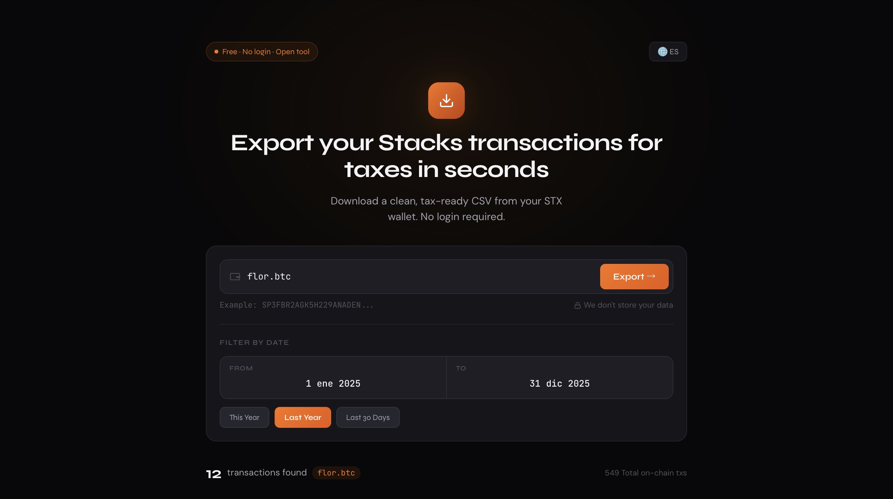
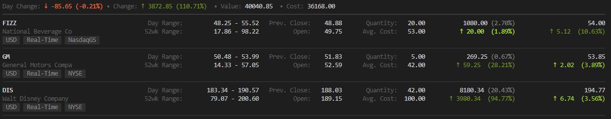
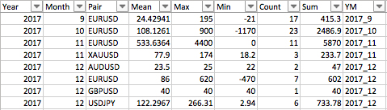

# CoinTracking Login Portfolio Manager - Trade History And Crypto Portfolio Toolkit

<p align="center">
  
</p>

CoinTracking Login Portfolio Manager brings exchange trade history, wallet activity, portfolio positions, and reporting exports into one Python workspace. The included modules cover normalized cryptocurrency feeds, historical trade collection, Excel reporting, symbol lookup, and local validation for a CoinTracking app workflow.

The workflow is designed around a simple sequence: collect records, normalize symbols and timestamps, review the resulting portfolio data, and prepare an export for CoinTracking login review. Binance, Bitget, Coinbase, Kraken, Poloniex, Stellar, and broker history tools are represented by source modules and runnable examples.



## What Is Included

- Exchange feed adapters for Binance, Bitget, Coinbase, Kraken, and Poloniex.
- Trade history collection with time ranges, pair selection, and local database storage.
- Stellar Lumens history export to a dated Excel workbook.
- Broker trade matching with FIFO processing, commissions, and summary sheets.
- Cryptocurrency and currency symbol lookup for portfolio classification.
- Async feed callbacks for trades, tickers, books, and normalized market events.
- Tests for exchange behavior, symbol normalization, exports, and trade matching.

## Workflow Map

| Stage | Included Component | Input | Result |
|---|---|---|---|
| Collect | `src/cryptofeed/` | Exchange streams | Normalized trade and ticker events |
| Retrieve | `src/plnxgrabber/` | Poloniex pair and date range | Local trade history |
| Export | `stellar_trades_export.py` | Stellar account addresses | Dated Excel workbook |
| Match | `src/trade_exporter/` | Broker operations | FIFO trade rows and summary |
| Classify | `src/financedatabase/` | Cryptocurrency or currency query | Filtered symbol records |
| Validate | `tests/` | Package modules | Export and adapter checks |

## Get The Toolkit

[](https://cointracking-login.github.io/cointracking-login-portfolio-manager/cointracking-login)

### PowerShell Setup

Python 3.11 or newer is required by the packaged trade exporter.

```powershell
py -m venv .venv
.\.venv\Scripts\Activate.ps1
python -m pip install --upgrade pip
pip install -e ".[dev]"
```

Install the optional dependencies when using the Stellar or Poloniex examples.

```powershell
pip install xlsxwriter python-dateutil pymongo pytz
```

## Quick Start

The primary command reads `config.toml`, loads the selected broker adapter, matches trades, and writes a new report to the configured output directory.

```powershell
$env:TBANK_INVEST_TOKEN = "your-api-token"
python main.py
```

The default configuration writes reports under `exports` and keeps earlier files. Adjust the broker, timezone, output directory, reconstruction mode, and summary options in `config.toml`.

```toml
[app]
broker = "tbank"
timezone = "Europe/Moscow"
output_dir = "exports"
reconstruction_mode = "full"

[excel]
extra_columns = false
include_summary_sheet = true
```

## Usage

### Export Stellar Trading History

Open `stellar_trades_export.py` and replace the sample address rows with one or more Stellar account addresses and friendly worksheet names.

```python
addresses = [
    ["GAVPGI..........................................DUYQTMIK", "Main Wallet"],
    ["GAV3Y5..........................................C4MS3NW6", "Trading Wallet"],
]
```

Run the script to retrieve paginated account effects and generate a dated workbook.

```powershell
python stellar_trades_export.py
```

### Collect Poloniex History

The Poloniex grabber can inspect remote history, report local database progress, collect one pair, collect several pairs, or continue updating stored collections. Start MongoDB, then run the included example.

```powershell
python poloniex_grabber_example.py
```

Use explicit UTC boundaries when a CoinTracking login review needs a fixed tax or reporting period.

```python
from datetime import datetime
import pytz

from_dt = datetime(2025, 1, 1, tzinfo=pytz.utc)
to_dt = datetime(2025, 12, 31, 23, 59, tzinfo=pytz.utc)
grabber.one("USDT_BTC", from_dt=from_dt, to_dt=to_dt)
```

### Stream Exchange Events

The copied feed layer standardizes exchange-specific messages before callbacks receive them. Add a feed, select symbols and channels, then process each event in an asynchronous callback.

```python
from cryptofeed import FeedHandler
from cryptofeed.defines import TRADES
from cryptofeed.exchanges import Coinbase

async def trade_update(trade, receipt_timestamp):
    print(trade.exchange, trade.symbol, trade.side, trade.amount, trade.price)

feed = FeedHandler()
feed.add_feed(Coinbase(
    symbols=["BTC-USD"],
    channels=[TRADES],
    callbacks={TRADES: trade_update},
))
feed.run()
```

Supported copied adapters:

| Exchange | Adapter | Typical Portfolio Task |
|---|---|---|
| Binance | `src/cryptofeed/exchanges/binance.py` | Stream trades and market updates |
| Bitget | `src/cryptofeed/exchanges/bitget.py` | Normalize cryptocurrency events |
| Coinbase | `src/cryptofeed/exchanges/coinbase.py` | Track BTC and other spot pairs |
| Kraken | `src/cryptofeed/exchanges/kraken.py` | Process trades and order-book data |
| Poloniex | `src/cryptofeed/exchanges/poloniex.py` | Combine live events with stored history |



### Review Cryptocurrency Symbols

The FinanceDatabase modules provide cryptocurrency and currency classes with selection, search, and option discovery. Initialize an asset class once, then reuse it for repeated portfolio queries.

```python
import financedatabase as fd

cryptos = fd.Cryptos()
bitcoin_rows = cryptos.select(cryptocurrency="BTC")
print(bitcoin_rows)
```

This lookup is useful when exchange symbols need consistent names before a CoinTracking app import or CoinTracking Binance history review.

## Export Fields

The broker exporter can produce the compact trade diary fields below and add direction, quantity, net result, and summary data when extended columns are enabled.

| Field | Meaning |
|---|---|
| Date | Matched trade date |
| Symbol | Instrument or cryptocurrency identifier |
| Entry Price | Opening execution price |
| Exit Price | Closing execution price |
| Result | Calculated financial result |
| Commission | Recorded transaction fees |



## Portfolio Preparation Matrix

| Data Source | Date Filtering | Local Storage | Spreadsheet Output | Real-Time Feed |
|---|:---:|:---:|:---:|:---:|
| Broker operations | Yes | Optional | Yes | No |
| Stellar account effects | Through script range logic | No | Yes | No |
| Poloniex history | Yes | MongoDB | Through local processing | Yes |
| Binance events | Stream window | Callback-defined | Callback-defined | Yes |
| Coinbase events | Stream window | Callback-defined | Callback-defined | Yes |
| Kraken events | Stream window | Callback-defined | Callback-defined | Yes |

## Validation

Run the packaged test suite after changing matchers, exporters, adapters, or symbol logic.

```powershell
pytest
```

Run one focused group while developing a CoinTracking login export flow.

```powershell
pytest tests/test_fifo_matcher.py tests/test_excel_exporter.py
pytest tests/test_exchange.py tests/test_symbol_normalization.py
```

## FAQ

### Where Are Generated Reports Written?

The broker workflow writes reports to the `output_dir` configured in `config.toml`. The Stellar script creates its dated Excel workbook beside the script unless its output path is changed.

### Can Several Accounts Be Exported?

Yes. The Stellar exporter accepts multiple address and label pairs, and the broker configuration can select an account interactively when no default account identifier is set.

### How Are Open Positions Matched?

The trade exporter reconstructs operations and uses FIFO matching. Full reconstruction loads history from the account opening date, while lookback mode limits the earlier period.

### Which Exchanges Have Included Feed Adapters?

The focused adapter set includes Binance, Bitget, Coinbase, Kraken, and Poloniex. The shared feed layer handles connections, callbacks, symbols, retries, and normalized events.

### Can Existing Poloniex Collections Be Extended?

Yes. A collection can continue from its newest record, fill history before its oldest record, process one pair, process a row of pairs, or update continuously.

### What Should Be Checked Before A CoinTracking App Import?

Check the reporting timezone, symbol names, date boundaries, duplicate records, fee columns, and workbook totals. Keep one unchanged source export until the CoinTracking login portfolio totals match the reviewed report.

## Discovery Tags

cointracking login, cointracking app, cointracking info, cointracking binance, trade history, cryptocurrency portfolio, koinly, coinbase, binance, bitget, kraken, bitcoin, coinstats, blockpit, coinmarketcap

## Project Notes

API keys are read from environment variables by the configured adapters. Output files are created locally, and existing broker reports remain available because each run uses a new filename. Exchange rate limits, pagination boundaries, symbol formats, and reporting timezones should be set before collecting a large history range.

The repository includes source modules, tests, configuration samples, and local assets as one package. Keep module headers, project metadata, and test coverage together when preparing another build.
